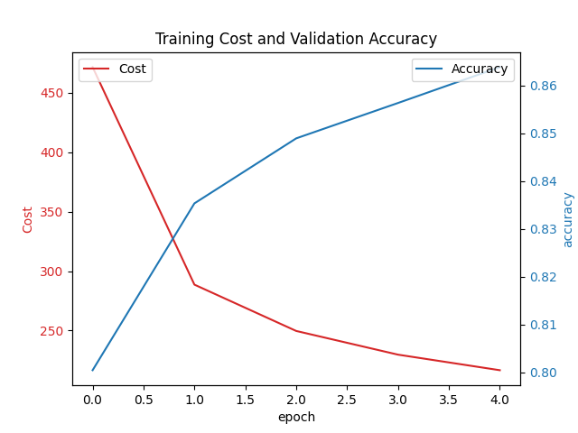

# Fashion MNIST CNN (PyTorch)

## 🚀 Open the Project
👉 [View full notebook](./fashion_mnist_cnn_pytorch.ipynb)

## 📌 Overview
This project implements a **Convolutional Neural Network (CNN)** using **PyTorch** to classify images from the **Fashion-MNIST dataset**.

Fashion-MNIST is a dataset of 70,000 grayscale images of clothing items across 10 categories.

The goal of this project is to train a deep learning model that can correctly classify clothing images.

---

## Dataset
Fashion-MNIST contains:

- 60,000 training images
- 10,000 test images
- Image size: 28 × 28 grayscale
- 10 classes

Classes include:

- T-shirt / Top
- Trouser
- Pullover
- Dress
- Coat
- Sandal
- Shirt
- Sneaker
- Bag
- Ankle boot

---

## Technologies Used

- Python
- PyTorch
- Torchvision
- Matplotlib
- Jupyter Notebook

---

## Model Architecture

The CNN model consists of:

Conv Layer → ReLU → MaxPool  
Conv Layer → ReLU → MaxPool  
Fully Connected Layer  
Softmax Classification

---

## Training

The model was trained using:

- CrossEntropyLoss
- SGD / Adam optimizer
- Mini-batch training

---

## Results

The CNN model achieved high classification accuracy on the Fashion-MNIST test dataset.

Example output:

Test Accuracy: ~90%

## Training Results

The CNN training cost and validation accuracy across epochs.

---

## Repository Structure

fashion-mnist-cnn
│
├── fashion_mnist_cnn_pytorch.ipynb
└── README.md

## 🧠 Model Architecture

- Convolutional layers with ReLU activation  
- MaxPooling layers for downsampling  
- Fully connected layers  
- Softmax output layer (10 classes)

## 📊 Results

The CNN model achieved high classification performance on the Fashion-MNIST dataset.

- Test Accuracy: ~99%
- Validation Accuracy: ~98–99%
- Model successfully classifies clothing images across 10 categories

## Future Improvements

- Hyperparameter tuning
- Training on GPU
- Data augmentation
- Deploy model using TorchScript or FastAPI

---

## Author

Shaida Khan  
Entry-Level Data Scientist | Machine Learning | Python
